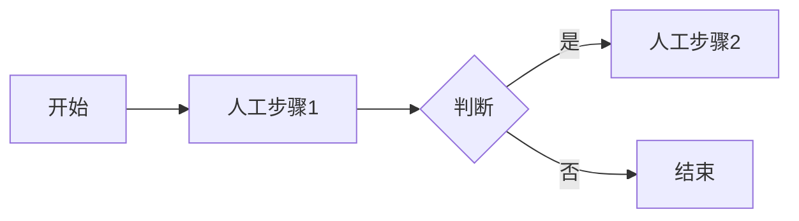
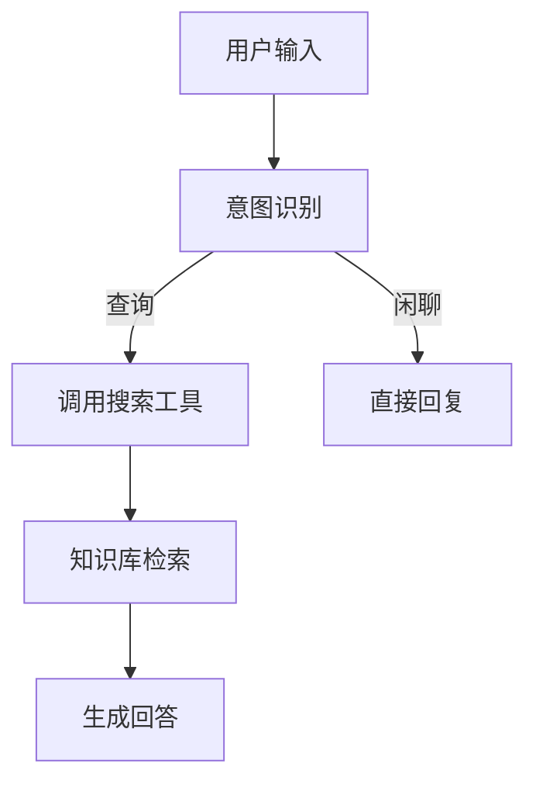

# [产品名称] Agent PRD

> 版本：v2.2.1
> 作者：
> 日期：
> 状态：草稿/评审中/已确认

**文档导航**：
1. 定义 ([1](#一需求背景与目标)-[3](#三用户旅程设计))
2. 设计 ([4](#四uiux-设计)-[6](#六详细功能点))
3. 技术 ([7](#七技术架构设计)-[8](#八提示词设计))
4. 保障 ([9](#九评测体系)-[11](#十一项目计划))
5. 运维 ([12](#十二上线运维与持续优化))
专题：Agent 核心能力设计（Memory / Tool / Reflection）

---

## 一、需求背景与目标

### 1.1 业务背景
- **痛点描述**：
- **当前解决方案**：
- **为什么不满足**：

### 1.2 商业价值与目标
| 目标维度 | 关键指标 (KPI) | 当前值 | 目标值 (上线后3个月) |
|---------|---------------|-------|--------------------|
| 效率 | 平均处理时长 | | |
| 成本 | 人工投入成本 | | |
| 体验 | 满意度评分 | | |

### 1.3 利益相关者
- **核心用户**：
- **决策者**：
- **协作方**：

**✅ 阶段1完成检查**:
- [ ] 痛点已量化（频率、成本、影响范围）
- [ ] 目标KPI已定义且可衡量
- [ ] 利益相关者已识别

---

## 二、现有流程与 Agent Story

### 2.1 As-Is 业务流程


**自动化机会点标注**：
- [ ] 步骤X：可自动化，理由...
- [ ] 步骤Y：需人工确认，理由...

### 2.2 Agent Story 列表
| ID | 角色 (Role) | 能力 (Ability) | 价值 (Value) | 优先级 |
|----|------------|---------------|-------------|-------|
| AS-1 | 客服助手 | 自动回答常见问题 | 减少人工工作量 | P0 |
| AS-2 | 订单管家 | 查询订单状态 | 提升响应速度 | P0 |

**Agent Story 详细说明**：
- **AS-1**: 作为[Agent角色]，我能够[感知/操作]，以便[达成结果]
  - 触发条件：
  - 输入数据：
  - 输出结果：
  - 成功标准：

### 2.3 第一性原理审查
**人类流程中的"适应性步骤"分析**：
- [ ] 是否存在仅为适应人类记忆限制的步骤？（如反复确认、记录备忘）
- [ ] 是否存在仅为适应人类算力限制的步骤？（如简化计算、经验法则）
- [ ] Agent 是否有更优路径？

**✅ 阶段2完成检查**:
- [ ] As-Is 流程图已绘制
- [ ] 自动化机会点已标注
- [ ] 已通过第一性原理审查：移除了仅为适应人类弱点而存在的步骤
- [ ] Agent Story 列表已编写（至少3条）
- [ ] 每个 Agent Story 都有详细说明

---

## 三、用户旅程设计

### 3.1 To-Be 用户旅程
**触发场景**：
- 场景1：
- 场景2：

**交互流程**：
1. 用户操作 → Agent 响应 → 结果展示
2. ...

### 3.2 Agent Workflow (内部逻辑)


**Workflow 详细说明**：
1. **感知阶段**：用户输入什么？需要查询什么数据？
2. **思考阶段**：如何拆解任务？需要调用什么工具？
3. **行动阶段**：执行API调用、生成内容
4. **反馈阶段**：结果展示、错误重试、人工接管

### 3.3 人机边界 (HMI Boundary)
- **完全自动**: [列出全自动环节]
- **人工确认**: [列出需要人工点击确认的环节]
- **人工接管**: [列出转人工的触发条件]

**异常流程**：
- 场景1：工具调用失败 → 重试策略 → 降级方案
- 场景2：置信度低 → 转人工条件

**✅ 阶段3完成检查**:
- [ ] 泳道图已绘制（用户/Agent/后台）
- [ ] 人机边界已明确定义
- [ ] 异常流程已考虑（转人工条件）
- [ ] Workflow 四个阶段（感知/思考/行动/反馈）已详细说明

---

## 四、UI/UX 设计

### 4.1 核心界面
- [ ] 聊天窗口样式
- [ ] 快捷指令区
- [ ] 结果展示卡片

**设计原则**：
- **第一性原理**：用户要结果，不要闲聊
- **交互优化**：如果点击比打字快，就做按钮
- **避免为AI而AI**：不强行对话

### 4.2 交互细节
- **Loading状态**: "正在查询数据库..." (显示具体动作)
- **引用展示**: [1] 文档名称 (点击跳转)
- **反馈机制**: 👍 / 👎 按钮

### 4.3 状态可视化
- **Thinking**: 显示 Agent 正在思考的步骤
- **Typing**: 流式输出效果
- **Tool Calling**: 显示正在调用的工具名称

### 4.4 结构化输出组件
- **订单卡片**: 物流进度条、订单详情
- **知识卡片**: 来源引用、置信度标识
- **操作按钮**: 快捷指令、常用操作

### 4.5 错误与兜底交互
- **错误提示**: 友好的错误信息，提供解决方案
- **兜底方案**: 转人工入口、重试按钮

**✅ 阶段4完成检查**:
- [ ] 核心界面原型已完成
- [ ] 没有为了AI而AI（强行对话）的设计
- [ ] 状态可视化方案已设计
- [ ] 错误/兜底交互已定义
- [ ] 结构化输出组件已设计

---

## 五、功能框架

### 5.1 产品架构图
- 接入层 (Web/App/API)
- Agent核心层 (Planning, Memory, Tools)
- 基础模型层 (LLM)
- 数据层 (Vector DB, SQL)

### 5.2 MVP 功能清单
| 模块 | 功能点 | 说明 | 优先级 |
|------|-------|------|-------|
| 对话 | 多轮对话 | 支持上下文保持 | P0 |
| 知识 | 文档问答 | 支持PDF/Word上传 | P0 |
| 工具 | 联网搜索 | Google Search API | P1 |

### 5.3 模块划分
- **记忆模块 (Memory)**: 短期/长期记忆管理
- **工具模块 (Tools)**: API调用、数据查询
- **规划/反思模块 (Planning/Reflection)**: 任务拆解、执行顺序、自检与复盘

### 5.4 MVP 范围确认
**P0 (必须有)**：
- 功能1：
- 功能2：

**P1 (重要但可延后)**：
- 功能3：

**P2 (Nice to have)**：
- 功能4：

**已砍掉的功能**：
- 功能X：理由...

**✅ 阶段5完成检查**:
- [ ] MVP 范围已明确（P0/P1/P2）
- [ ] 功能架构图已绘制
- [ ] 砍掉了至少一个"想要但不必要"的功能
- [ ] 模块划分清晰（Memory/Tools/Planning/Reflection）

---

## 六、详细功能点

### 6.1 功能 [F-01]: [名称]
- **输入**:
- **处理逻辑**:
- **输出**:
- **异常处理**:

### 6.2 功能 [F-02]: [名称]
- **输入**:
- **处理逻辑**:
- **输出**:
- **异常处理**:

**✅ 阶段6完成检查**:
- [ ] 每个功能点有明确的输入/输出定义
- [ ] 异常流程已覆盖
- [ ] 开发同学已评审并确认可理解
- [ ] 字段定义清晰、数据更新机制明确

---

## 专题：Agent 核心能力设计 ⭐

> 本章节对应工作流"专题：Agent 核心能力 (Memory / Tool / Reflection)"
> 详细模板参见: `assets/agent-core-capabilities-template.md`

### 7.1 Memory (记忆能力)

#### 记忆类型与范围
- **短期记忆**:
  - 创建时机：
  - 生命周期：
  - 清理策略：
- **长期记忆**:
  - 写入条件：
  - 是否可编辑/删除：
- **范围边界**: 仅对当前用户/会话可见？跨会话共享？

#### 数据结构与存储
- **字段结构**: (示例) `key`, `value`, `confidence`, `source`, `timestamp`, `scope`
- **存储介质**: 向量库/关系型/文档库/文件
- **索引策略**: 关键词/向量/混合检索

#### 写入与检索策略
- **写入触发**: 规则/模型判别/用户确认
- **检索触发**: 触发条件、top-k、阈值
- **冲突解决**: 新旧冲突处理、置信度策略

#### 隐私与合规
- **敏感字段**: 需要脱敏/不存储的内容
- **用户可控**: 查看/修改/删除入口

### 7.2 Tool (工具能力)

#### 工具清单
| 工具 | 作用 | 权限范围 | 触发条件 | 失败回退 |
|------|------|----------|----------|----------|
| 工具1 | | | | |
| 工具2 | | | | |

#### 调用策略
- **自动调用 vs. 用户确认**:
- **速率/频次限制**:
- **失败处理**: 重试次数/降级/人工接管

#### 安全边界
- **高风险操作**: 必须人审/双确认
- **最小权限原则**: 仅开放必要能力

### 7.3 Reflection (反思能力)

#### 触发条件
- **任务结束**: 是否强制反思
- **错误/低置信度**: 触发阈值
- **用户反馈**: 👍/👎 触发

#### 评估标准
- **正确性**:
- **效率**:
- **一致性**:

#### 迭代闭环
- **输出**: 需要更新的 Prompt/策略/数据
- **回流位置**: 评测集/规则库/工具调用策略

**✅ 核心能力完成检查**:
- [ ] Memory 策略已定义并与隐私/合规对齐
- [ ] Tool 可用性与权限边界已确认
- [ ] Reflection 机制已与评测与迭代流程打通

---

## 七、技术架构设计 ⭐

### 8.1 核心选型
- **LLM 模型**: [例如: GPT-4o (主) + GPT-4o-mini (路由)]
  - 选型理由：
  - 备选方案：
- **Agent 框架**: [例如: LangChain Python / 原生 Loop + Function Call]
  - 选型理由：**第一性原理：如无必要，勿增实体（框架/层级）**
  - 是否真的需要框架？简单的 Loop + Function Call 是否更稳健？
- **向量数据库**: [例如: Pinecone / Milvus / 不需要]
  - 选型理由：

### 8.2 RAG 策略 (如适用)
- **是否需要 RAG**: 是/否，理由...
- **切片大小 (Chunk Size)**: [例如: 500 tokens]
- **重叠 (Overlap)**: [例如: 50 tokens]
- **检索方式**: [例如: 混合检索 (关键词+向量)]
- **Embedding 模型**: [例如: text-embedding-3-small]

### 8.3 多 Agent 协作模式 (可选)
- **是否需要多 Agent**: 是/否，理由...
- **协作模式**: [例如: 路由模式 / 顺序流 / 并行执行]
- **角色分工**:
  - Agent A: 负责...
  - Agent B: 负责...

### 8.4 技术架构图
```
[在此绘制或插入架构图]
用户 -> API Gateway -> Agent 核心 -> LLM
                          ↓
                    Tools / RAG / Memory
```

### 8.5 数据流图
```
输入 -> 预处理 -> 意图识别 -> 工具调用 -> 结果生成 -> 输出
```

**✅ 阶段7完成检查**:
- [ ] 模型选型已确定并有理由
- [ ] Agent 框架选型已通过第一性原理审查
- [ ] 技术架构图已绘制
- [ ] 数据流图已绘制
- [ ] 成本预估已完成（见第十章） 

---

## 八、提示词设计

### 9.1 System Prompt
> 见独立的 Prompt 文件或在此粘贴核心逻辑。

**结构化要求**：
- 使用 XML 标签结构化 Prompt
- 包含角色定义、能力边界、输出格式

**示例结构**：
```xml
<role>
你是一个专业的客服助手...
</role>

<capabilities>
- 能力1: 查询订单
- 能力2: 回答政策问题
</capabilities>

<constraints>
- 不能处理退款金额 > 500元的请求
- 遇到愤怒情绪必须转人工
</constraints>

<output_format>
使用结构化JSON格式输出...
</output_format>
```

### 9.2 Few-shot 示例库
| 场景 | 用户输入 | 期望输出 | 说明 |
|------|---------|---------|------|
| 示例1 | | | |
| 示例2 | | | |
| 示例3 | | | |

### 9.3 工具定义 (Tools)
```json
{
  "name": "tool_name",
  "description": "工具描述...",
  "parameters": {
    "type": "object",
    "properties": {
      "param1": {
        "type": "string",
        "description": "参数说明"
      }
    },
    "required": ["param1"]
  }
}
```

**✅ 阶段8完成检查**:
- [ ] System Prompt 已使用 XML 结构化
- [ ] Few-shot 示例已准备（至少3个）
- [ ] 工具定义已编写并测试
- [ ] Prompt 已在实际场景中测试

---

## 九、评测体系

### 10.1 评测集 (Golden Dataset)
- **来源**：[历史日志/人工编写/用户反馈]
- **规模**：[例如: 50条核心case]
- **覆盖场景**：
  - 场景1: X条
  - 场景2: Y条
  - 边界case: Z条

### 10.2 评测指标
| 指标 | 定义 | 目标值 | 当前值 |
|------|------|--------|--------|
| 准确率 | 回答正确的比例 | > 90% | |
| 幻觉率 | 生成虚假信息的比例 | < 5% | |
| 响应时间 (P95) | 95%请求的响应时间 | < 3s | |
| Token 消耗 | 平均每次对话的 Token 数 | < 1000 | |

### 10.3 成功标准
- 准确率 > 90%
- 幻觉率 < 5%
- 响应时间 < 3s (P95)
- 用户满意度 > 4.0/5.0

### 10.4 自动化评测工具
- **工具选择**: [例如: Promptfoo / Ragas / 自研]
- **评测频率**: [例如: 每次 Prompt 更新后]
- **评测脚本**: [链接或路径]

### 10.5 Golden Dataset 示例
```json
[
  {
    "id": "case-001",
    "input": "我的订单什么时候到？",
    "expected_output": "请提供您的订单号，我帮您查询物流信息。",
    "ground_truth": "需要先获取订单号",
    "tags": ["订单查询", "信息收集"]
  }
]
```

**✅ 阶段9完成检查**:
- [ ] 评测指标已定义
- [ ] Golden Dataset 已准备（至少50条）
- [ ] 自动化评测脚本可运行
- [ ] 评测结果可追踪和对比

---

## 十、非功能需求 (NFR)

### 11.1 成本估算
**Token 消耗预估**：
- 单次会话平均 Token 数：
  - System Prompt: X tokens
  - 用户输入: Y tokens
  - 工具调用: Z tokens
  - 输出: W tokens
  - **总计**: X+Y+Z+W tokens

**成本计算**：
- 单次会话成本：[例如: $0.01]
- 预计日活用户：[例如: 1000人]
- 平均每人对话轮数：[例如: 5轮]
- **单日成本**：[例如: $50]
- **月度成本**：[例如: $1500]

**ROI 分析**：
- 当前人工成本：[例如: $10000/月]
- Agent 成本：[例如: $1500/月]
- **节省成本**：[例如: $8500/月]
- **ROI**: [例如: 566%]

### 11.2 性能要求
| 指标 | 目标值 | 说明 |
|------|--------|------|
| 首字延迟 (TTFT) | < 1s | Time To First Token |
| 总生成时间 | < 3s (P95) | 完整响应时间 |
| 并发支持 | 100 QPS | 每秒查询数 |
| 可用性 | 99.9% | 年度停机时间 < 8.76小时 |

### 11.3 安全与合规
**安全红线**：
- [ ] 防 Prompt 注入攻击
- [ ] 敏感词过滤
- [ ] 个人隐私脱敏 (PII)
- [ ] 数据加密存储

**合规要求**：
- [ ] GDPR 合规（如适用）
- [ ] 数据留存政策
- [ ] 用户数据删除机制

### 11.4 可观测性
- **日志记录**: 请求/响应、错误、性能指标
- **监控告警**: Token 消耗异常、响应延迟、错误率
- **追踪系统**: [例如: LangSmith / 自研]

**✅ 阶段10完成检查**:
- [ ] 成本估算表已完成
- [ ] ROI 计算结果为正
- [ ] 安全红线已定义
- [ ] 性能指标已明确
- [ ] 可观测性方案已设计

---

## 十一、项目计划

### 12.1 里程碑
| 阶段 | 交付物 | 预计时间 | 负责人 |
|------|-------|---------|--------|
| 设计 | PRD, UI稿 | T+1周 | |
| 开发 | Demo版本 | T+2周 | |
| 调优 | Prompt迭代 | T+3周 | |
| 上线 | 发布 | T+4周 | |

### 12.2 风险管理
| 风险 | 影响 | 概率 | 应对方案 | 负责人 |
|------|------|------|---------|--------|
| 模型效果不及预期 | 高 | 中 | 增加 RAG 优化时间 | |
| 成本超预算 | 中 | 低 | 切换到更便宜的模型 | |
| 数据隐私问题 | 高 | 低 | 提前进行合规审查 | |

### 12.3 资源需求
- **人力**:
  - 产品经理: X人
  - 全栈工程师: Y人
  - 提示词工程师: Z人
- **基础设施**:
  - LLM API 额度: $XXX/月
  - 向量数据库: $YYY/月
  - 服务器: $ZZZ/月

**✅ 阶段11完成检查**:
- [ ] 里程碑已定义
- [ ] 风险清单已识别并有应对方案
- [ ] 资源需求已确认
- [ ] 关键路径已识别

---

## 十二、上线运维与持续优化

> 本章节对应工作流"阶段12：上线运维与持续优化"

### 13.1 监控指标

#### 业务指标
| 指标 | 定义 | 目标值 | 告警阈值 |
|------|------|--------|----------|
| 用户满意度 (CSAT) | 👍/(👍+👎) | > 80% | < 70% |
| 转人工率 | 转人工次数/总对话数 | < 20% | > 30% |
| 任务完成率 | 成功完成任务/总任务数 | > 85% | < 75% |

#### 技术指标
| 指标 | 定义 | 目标值 | 告警阈值 |
|------|------|--------|----------|
| Token 消耗 | 日均 Token 数 | < 100K | > 150K |
| 响应延迟 P50 | 50%请求的响应时间 | < 1s | > 2s |
| 响应延迟 P95 | 95%请求的响应时间 | < 3s | > 5s |
| 响应延迟 P99 | 99%请求的响应时间 | < 5s | > 10s |
| 错误率 | 错误次数/总请求数 | < 1% | > 3% |

#### 异常流量告警
- Token 消耗突增 > 50%
- 错误率突增 > 5%
- 响应延迟 P95 > 5s

### 13.2 数据飞轮

#### Bad Case 收集流程
1. **来源**:
   - 用户反馈 (👎)
   - 转人工记录
   - 错误日志
   - 人工抽检

2. **分类**:
   - 意图识别错误
   - 工具调用失败
   - 知识库缺失
   - 输出格式错误
   - 幻觉/事实错误

3. **处理流程**:
   ```
   Bad Case 发现 -> 标注分类 -> 根因分析 ->
   -> 解决方案 (Prompt优化/数据补充/工具修复) ->
   -> 加入评测集 -> 回归测试 -> 上线
   ```

#### 评测集扩充策略
- 每周新增 10-20 条 Bad Case 到评测集
- 保持评测集覆盖所有核心场景
- 定期清理过时的测试用例

#### Prompt 迭代流程
1. 识别问题 (Bad Case 分析)
2. 提出假设 (Prompt 改进方向)
3. 小范围测试 (评测集验证)
4. 灰度发布 (5% 流量)
5. 全量发布 (监控指标)

#### RLHF 数据积累
- 收集用户反馈 (👍/👎)
- 标注优质对话
- 为未来微调做准备

### 13.3 灰度策略

#### 灰度发布流程
1. **准备阶段**:
   - 新 Prompt 版本通过评测集验证
   - 准备回滚方案

2. **灰度阶段**:
   - 5% 流量 (观察 24 小时)
   - 20% 流量 (观察 24 小时)
   - 50% 流量 (观察 24 小时)
   - 100% 全量

3. **监控指标**:
   - 对比新旧版本的准确率、满意度、Token 消耗
   - 如指标下降 > 5%，立即回滚

#### A/B 测试方案
- **对照组**: 当前版本
- **实验组**: 新版本
- **分流策略**: 用户 ID hash
- **评估周期**: 7 天
- **决策标准**: 满意度提升 > 3% 且成本不增加

### 13.4 运维 Dashboard

#### 核心看板
- **实时监控**: Token 消耗、QPS、错误率、响应延迟
- **趋势分析**: 日活用户、对话轮数、转人工率
- **成本分析**: 日成本、月成本、成本趋势

#### 告警配置
- **P0 告警** (立即响应):
  - 错误率 > 5%
  - 服务不可用
- **P1 告警** (1小时内响应):
  - Token 消耗异常
  - 响应延迟 P95 > 5s
- **P2 告警** (24小时内响应):
  - 满意度下降 > 10%
  - 转人工率上升 > 10%

### 13.5 迭代日志

#### 版本发布记录
| 版本 | 日期 | 变更内容 | 效果 | 负责人 |
|------|------|---------|------|--------|
| v1.0 | 2024-01-01 | 初始版本 | 基线 | |
| v1.1 | 2024-01-15 | 优化意图识别 Prompt | 准确率 +5% | |
| v1.2 | 2024-02-01 | 新增工具X | 任务完成率 +10% | |

#### 优化记录
- **2024-01-20**: 发现订单查询场景准确率低，补充 Few-shot 示例 3 条，准确率从 75% 提升到 90%
- **2024-02-05**: Token 消耗过高，优化 System Prompt 长度，成本降低 20%

**✅ 阶段12完成检查**:
- [ ] 监控 Dashboard 已搭建
- [ ] Bad Case 收集流程已建立
- [ ] 灰度发布机制已就绪
- [ ] 告警配置已完成
- [ ] 迭代日志模板已准备

---

## 附录

### A. 参考资源
- 技术架构指南: `references/tech-architecture-guide.md`
- UI/UX 设计指南: `references/ui-ux-design-guide.md`
- 提示词工程指南: `references/prompt-design-guide.md`
- 评测体系指南: `references/evaluation-guide.md`
- 成本估算指南: `references/cost-estimation-guide.md`

### B. 术语表
- **Agent**: 具备感知、规划、行动能力的 AI 系统
- **RAG**: 检索增强生成 (Retrieval-Augmented Generation)
- **Ground Truth**: 评测时的标准答案
- **TTFT**: Time To First Token，首字延迟
- **HMI**: Human-Machine Interface，人机边界

### C. 变更历史
| 版本 | 日期 | 变更内容 | 作者 |
|------|------|---------|------|
| v2.2.1 | 2026-02-05 | 对齐阶段编号，核心能力专题化，补齐运维阶段与闭环说明 | |
| v2.0 | 2024-01-01 | 初始版本 | |
