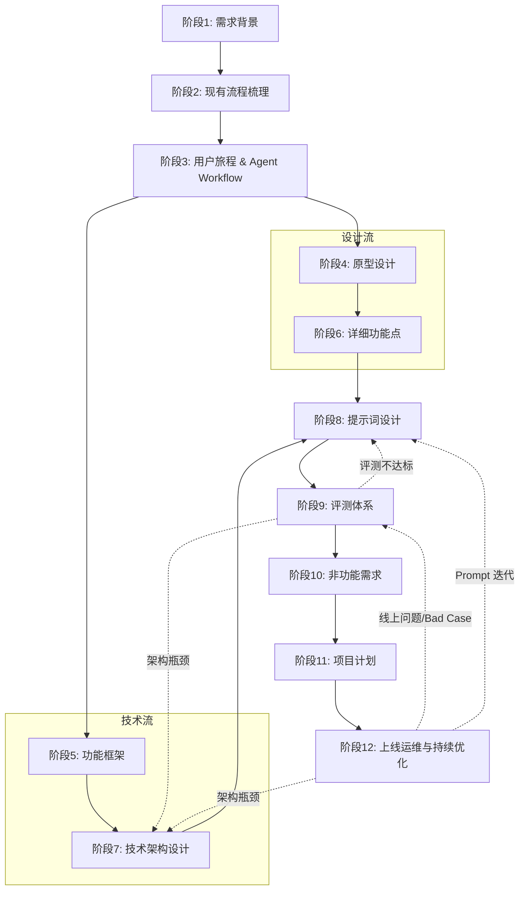

# Agent 开发阶段依赖关系图

## 关键依赖说明

1. **核心依赖链**：
   - **用户旅程 (S3)** 是分水岭。在此之前是纯业务分析；在此之后，设计（S4/S6）和技术（S5/S7）可以**并行**工作。
   
2. **提示词设计的依赖**：
   - 必须等待 **功能定义 (S6)** 明确输入输出。
   - 必须等待 **技术选型 (S7)** 确定模型能力（如是否支持 Function Calling）。

3. **评测闭环**：
   - S9 是最重要的迭代点。
   - 如果 Prompt 调优无法解决问题，可能需要回退到 S7 修改架构（如引入 RAG 或更换模型），甚至回退到 S6 修改功能定义（简化任务）。

4. **线上运维闭环**：
   - S12 持续产出 Bad Case 与监控信号，反向驱动 S9/S8/S7 的优化。
