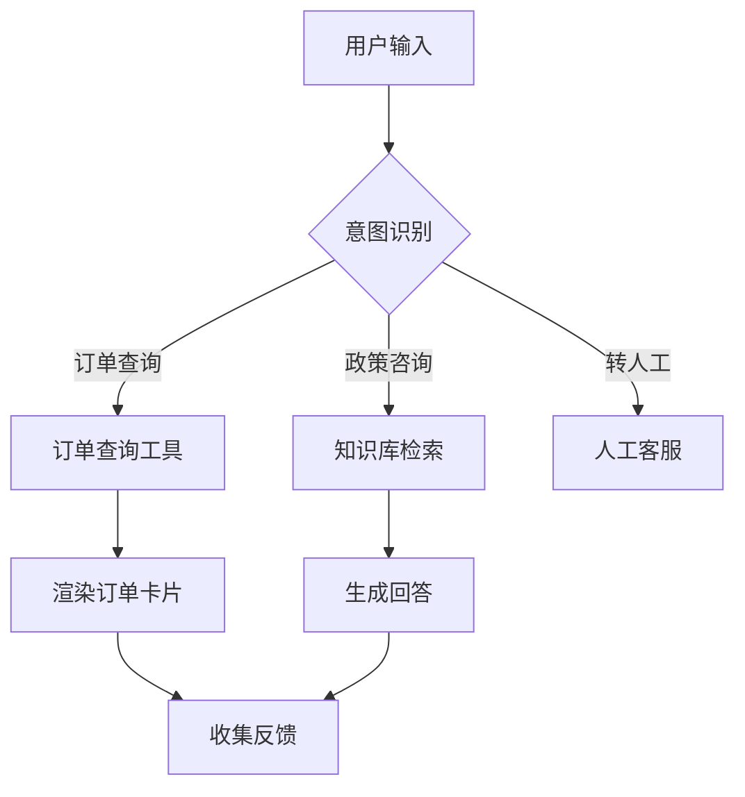

# Agent PRD 填写示例（精简版）

> 本文档展示如何填写 Agent PRD 模板的核心章节
> 完整模板参见: `assets/agent-prd-template.md`

---

## 示例场景：电商智能客服 Agent

### 一、需求背景与目标（示例）

#### 1.1 业务背景
- **痛点描述**：用户在购买前后有大量重复性咨询（物流查询、退换货政策、尺码咨询），目前人工客服 70% 的时间在处理此类问题，响应慢且成本高。
- **当前解决方案**：纯人工客服，平均响应时间 5 分钟，高峰期排队严重。
- **为什么不满足**：人工成本高（月薪 8000/人，需 5 人团队），响应慢导致用户流失率 15%。

#### 1.2 商业价值与目标
| 目标维度 | 关键指标 (KPI) | 当前值 | 目标值 (上线后3个月) |
|---------|---------------|-------|-------------------|
| 效率 | 平均响应时间 | 5分钟 | < 30秒 |
| 成本 | 客服人力成本 | 4万/月 | 1.5万/月 (减少62.5%) |
| 体验 | 用户满意度 | 3.2/5.0 | > 4.0/5.0 |

**✅ 填写要点**：
- 痛点要量化（频率、成本、影响范围）
- KPI 要可衡量，有明确的当前值和目标值

---

### 二、Agent Story（示例）

#### 2.2 Agent Story 列表
| ID | 角色 (Role) | 能力 (Ability) | 价值 (Value) | 优先级 |
|----|------------|---------------|-------------|-------|
| AS-1 | 订单助手 | 查询订单状态和物流信息 | 自动化 40% 的订单查询 | P0 |
| AS-2 | 政策顾问 | 回答退换货、保修政策 | 减少 30% 的政策咨询人工量 | P0 |
| AS-3 | 商品顾问 | 推荐商品、解答尺码问题 | 提升转化率 10% | P1 |

**Agent Story 详细说明**：
- **AS-1**: 作为订单助手，我能够通过订单号查询订单状态和物流信息，以便用户实时了解包裹位置
  - 触发条件：用户询问"订单在哪"、"什么时候到"等
  - 输入数据：订单号（用户提供或从历史对话提取）
  - 输出结果：订单状态 + 物流进度卡片
  - 成功标准：查询成功率 > 95%，响应时间 < 2s

**✅ 填写要点**：
- Agent Story 要具体，不要写"提升用户体验"这种空话
- 每个 Story 都要有可量化的价值

---

### 三、Agent Workflow（示例）



**人机边界**：
- **完全自动**：订单查询、常见政策问答
- **人工确认**：退款金额 > 500元
- **人工接管**：用户情绪愤怒、连续3次未解决问题

**✅ 填写要点**：
- Workflow 要清晰展示 Agent 的决策逻辑
- 人机边界要明确，避免"灰色地带"

---

### 专题：Agent 核心能力设计（示例）

#### 7.2 Tool (工具能力)

**工具清单**：
| 工具 | 作用 | 权限范围 | 触发条件 | 失败回退 |
|------|------|----------|----------|----------|
| OrderAPI | 查询订单状态 | 只读 | 用户提供订单号 | 提示用户检查订单号 |
| RefundAPI | 发起退款申请 | 写入（需人工审核） | 退款金额 < 500元 | 转人工处理 |

**调用策略**：
- **自动调用**：OrderAPI（只读操作，无风险）
- **用户确认**：RefundAPI（涉及金额，需用户点击确认）
- **失败处理**：重试 2 次，失败后转人工

**✅ 填写要点**：
- 工具要有明确的权限边界
- 高风险操作必须有人工确认机制

---

### 七、技术架构设计（示例）

#### 8.1 核心选型
- **LLM 模型**: GPT-4o-mini（主）
  - 选型理由：高频并发场景，注重成本，mini 模型足够应对客服场景
  - 备选方案：Claude 3.5 Haiku（如 OpenAI 不稳定）

- **Agent 框架**: 原生 Loop + Function Call
  - 选型理由：客服场景逻辑简单，不需要复杂框架，原生实现更稳定
  - 是否真的需要框架？**不需要**，LangChain 会增加不必要的复杂度

- **向量数据库**: Pinecone
  - 选型理由：需要 RAG 检索政策文档，Pinecone 托管服务运维成本低

**✅ 填写要点**：
- 选型要有理由，不要盲目跟风
- 通过第一性原理审查：能不用框架就不用

---

### 九、评测体系（示例）

#### 10.2 评测指标
| 指标 | 定义 | 目标值 | 当前值 |
|------|------|--------|--------|
| 准确率 | 回答正确的比例 | > 90% | 87% |
| 幻觉率 | 生成虚假信息的比例 | < 5% | 8% |
| 响应时间 (P95) | 95%请求的响应时间 | < 3s | 4.2s |
| Token 消耗 | 平均每次对话的 Token 数 | < 1000 | 1200 |

#### 10.5 Golden Dataset 示例
```json
[
  {
    "id": "case-001",
    "input": "我的订单什么时候到？",
    "expected_output": "请提供您的订单号，我帮您查询物流信息。",
    "ground_truth": "需要先获取订单号",
    "tags": ["订单查询", "信息收集"]
  },
  {
    "id": "case-002",
    "input": "订单号 12345 在哪里？",
    "expected_tool_call": "OrderAPI(order_id='12345')",
    "ground_truth": "调用订单查询工具",
    "tags": ["订单查询", "工具调用"]
  }
]
```

**✅ 填写要点**：
- 评测集要覆盖核心场景和边界 case
- 每条 case 都要有明确的 ground truth

---

### 十、非功能需求：成本估算（示例）

**Token 消耗预估**：
- System Prompt: 500 tokens
- 用户输入: 50 tokens
- 工具调用: 200 tokens
- 输出: 150 tokens
- **总计**: 900 tokens/次

**成本计算（价格为示例，请按最新定价更新）**：
- 单次会话成本：$0.0009（GPT-4o-mini: $0.15/1M input, $0.60/1M output）
- 预计日活用户：1000 人
- 平均每人对话轮数：3 轮
- **单日成本**：$2.7
- **月度成本**：$81

**ROI 分析**：
- 当前人工成本：$5,000/月（5人 × $1,000/月）
- Agent 成本：$81/月（LLM） + $500/月（人工监督 0.5人）= $581/月
- **节省成本**：$4,419/月
- **ROI**: 760%

**✅ 填写要点**：
- 成本要算细账，包括 Token 消耗和人工监督成本
- ROI 要算清楚，说服老板的关键

---

## 总结：填写 PRD 的关键原则

1. **量化一切**：痛点、目标、成本都要有数字
2. **具体胜于抽象**：不要写"提升体验"，要写"响应时间从 5 分钟降到 30 秒"
3. **第一性原理**：每个设计决策都要问"为什么"
4. **完成检查清单**：每个阶段都有验收标准，确保不遗漏

---

**参考资源**：
- 完整模板：`assets/agent-prd-template.md`
- 核心能力模板：`assets/agent-core-capabilities-template.md`
- 提示词示例：`examples/customer-service-agent/prompts.md`
- 评测数据集：`examples/customer-service-agent/eval-dataset.json`
