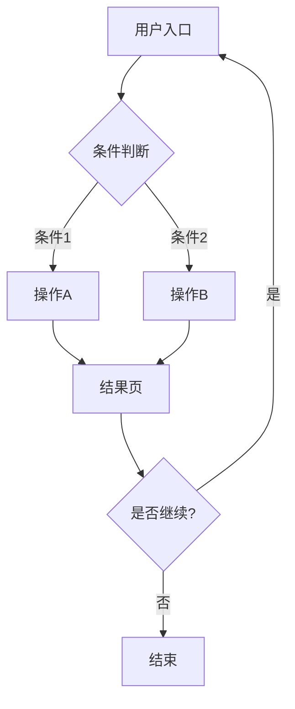
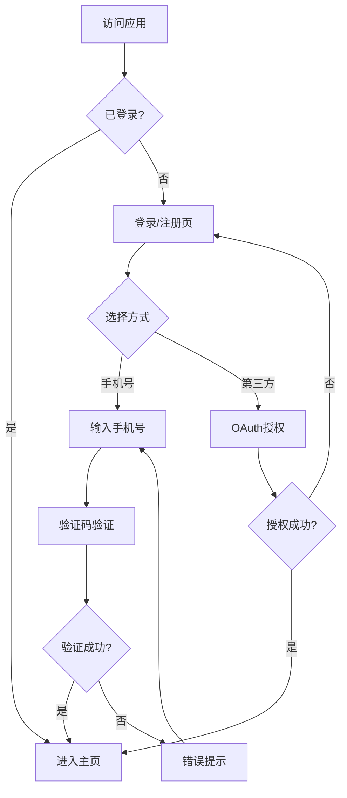
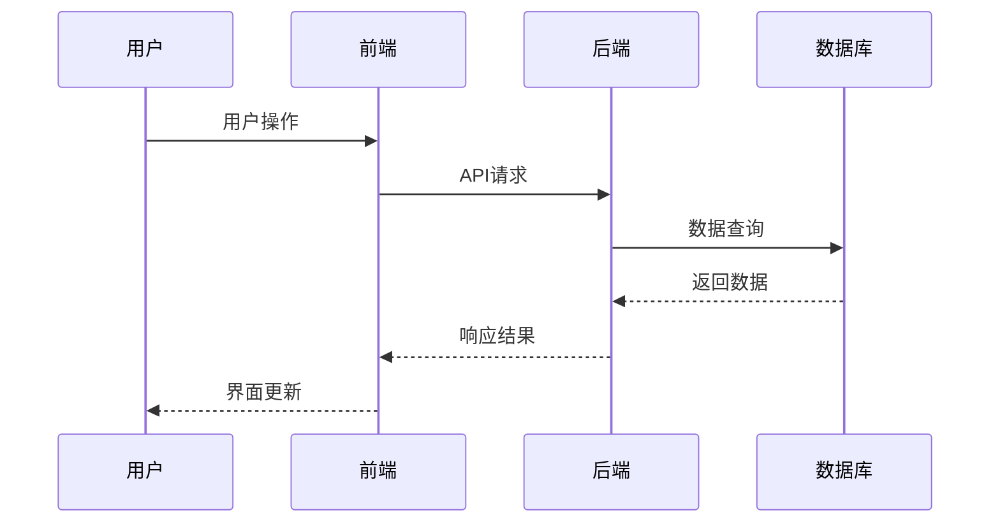
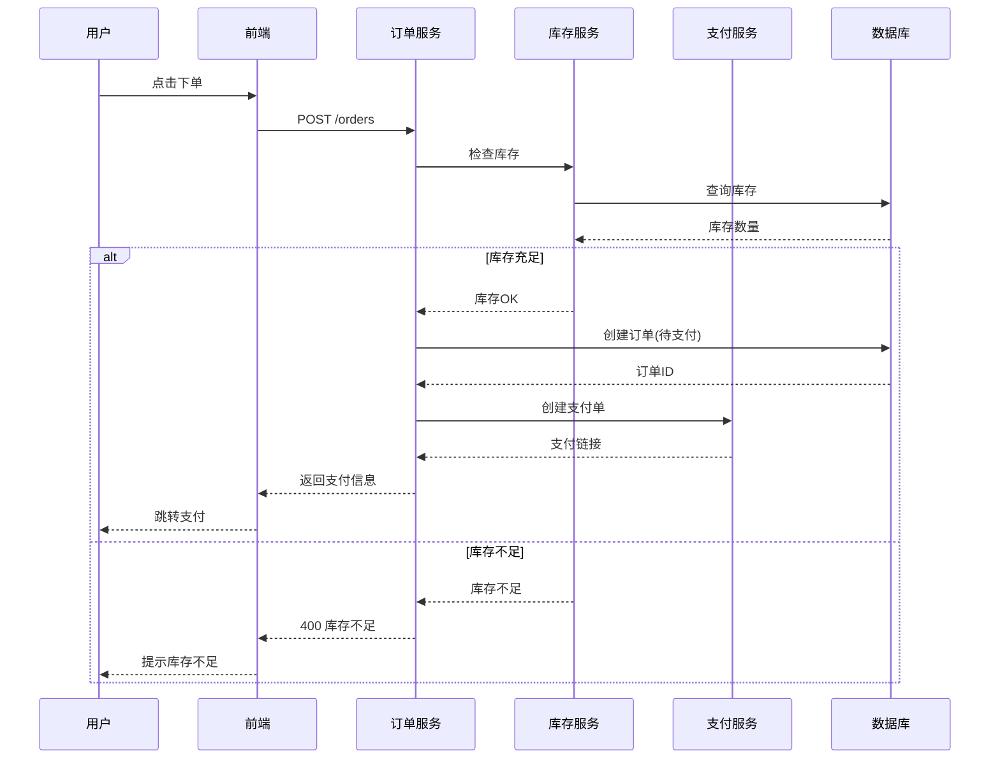
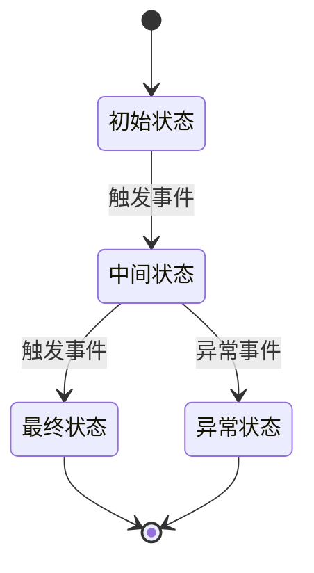
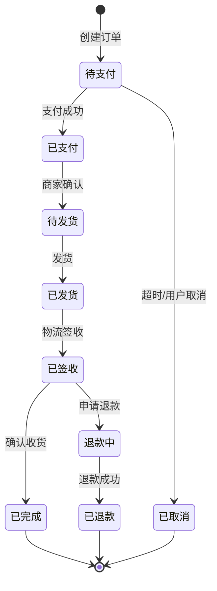
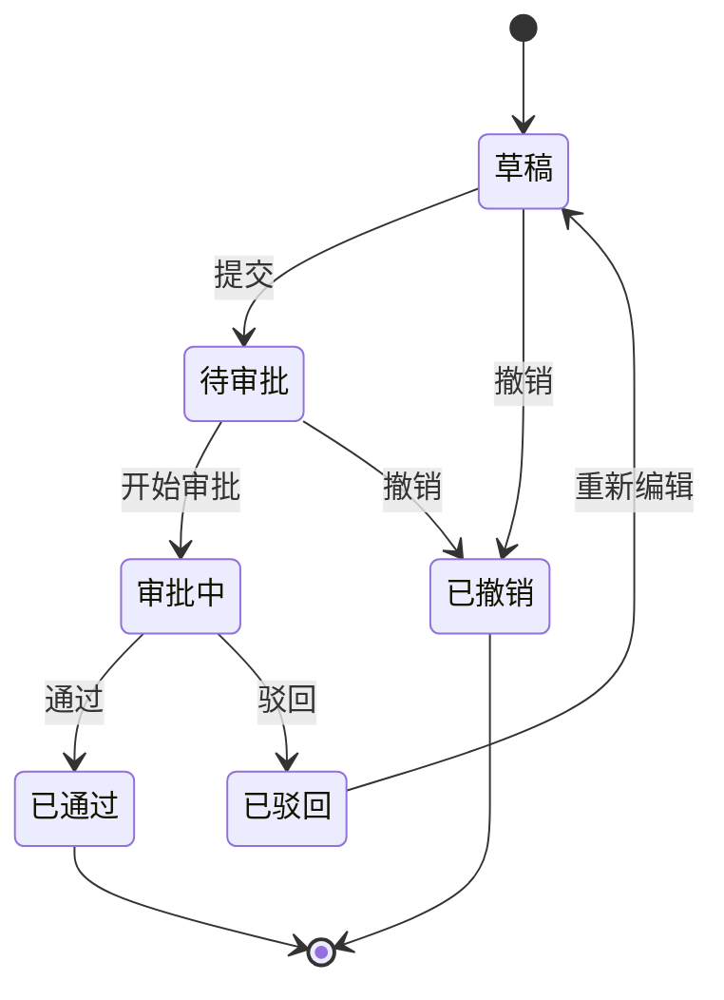
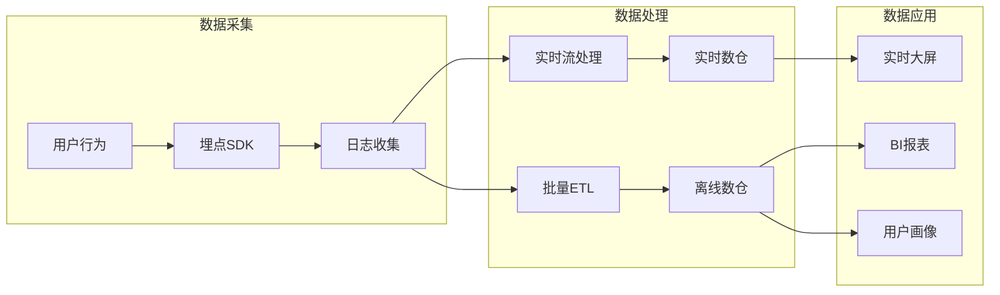
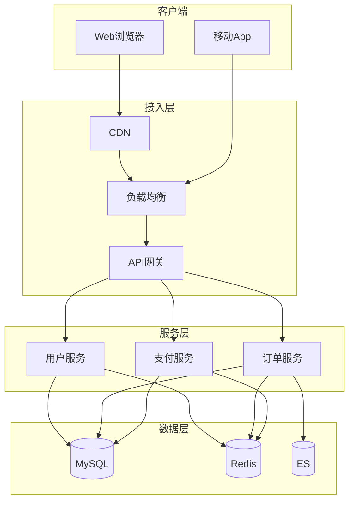

# 流程图模板库

本文档提供产品设计中常用的 Mermaid 流程图模板，用于可视化业务逻辑和数据流。

## 适用场景速查

| 图类型 | 适用场景 | 复杂度 |
|--------|----------|--------|
| 用户旅程图 | 展示用户操作路径、决策分支 | 低 |
| 序列图 | 展示系统间交互、API调用流程 | 中 |
| 状态机图 | 展示实体状态流转（订单、审批等） | 中 |
| 数据流图 | 展示数据在系统中的流动 | 高 |

---

## 1. 用户旅程流程图 (flowchart)

**用途**: 展示用户从入口到完成目标的完整路径，包含决策分支。

### 模板

### 示例：登录注册流程

---

## 2. 系统交互序列图 (sequenceDiagram)

**用途**: 展示前后端、微服务之间的调用顺序和数据流向。

### 模板

### 示例：订单创建流程

---

## 3. 状态机图 (stateDiagram-v2)

**用途**: 展示业务实体的状态流转，适用于订单、审批、工单等场景。

### 模板

### 示例：订单状态流转

### 示例：审批流程状态

---

## 4. 数据流图 (flowchart)

**用途**: 展示数据在系统各模块间的流动方向。

### 示例：用户数据流

---

## 5. 架构概览图 (flowchart)

**用途**: 展示系统整体架构和模块关系。

### 示例：典型Web应用架构

---

## 使用建议

1. **MVP阶段**: 优先画用户旅程图 + 1个核心业务序列图
2. **有状态实体**: 必须画状态机图，明确所有状态和转换条件
3. **复杂系统**: 补充数据流图和架构图
4. **图的粒度**: 一张图聚焦一个主题，避免过于复杂

## 命名规范

- 文件名: `flow-{功能名}.md` 或直接嵌入PRD
- 图标题: 使用中文，简洁明了
- 节点命名: 动词+名词，如"创建订单"、"验证身份"
